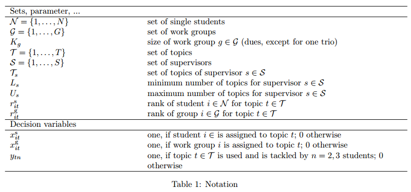
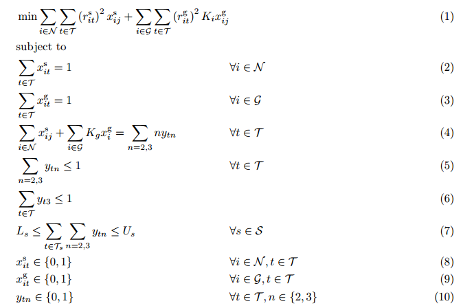

# topic-assignment-tool

At many university seminars, students have to form teams in order to tackle one of several offered topics. Each topic is offered by a supervisor and can only be tackled by one team exclusively. The goal is to match students with topics while best meeting students’ preferences and ensuring a high degree of fairness. A team usually consist of two students. Only if the number of seminar participants is odd, there is one team of three. Some students form a team beforehand, other do not. Furthermore, the workload between supervisors should be distributed fairly. To that end, students submit their preferences by ranking all topics. These ranks are then used in an integer linear model to assign students.

## Notation

## Model

Objective function (1) minimizes the sum of the squared ranks. The squares over-proportionally punish assigning a low ranged topic, thus favoring fair solutions. Constraints (2) and (3) ensure that each student and each team is assigned to a topic. Constraints (4) ensure that each topic is either treated by two or three students or not at all. Constraints (5) make sure that each topic gets either two or three students assigned, but not both, i.e. not five in total. Constraint (6) limits the number of topics with three students to a single one. Constraints (7) guarantee that each
supervisor gets enough, but not too many topics. Finally, constraints (8) to (10) define the variable domains.
